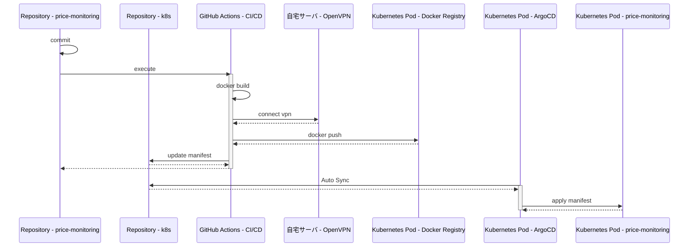

# price-monitoring

[](https://github.com/kuroweb/price-monitoring/actions/workflows/cicd-integration.yml) [](https://github.com/kuroweb/price-monitoring/actions/workflows/cicd-production.yml)

- Web上にある商品の最安値を探したり、相場を把握するためのツール
- Rails, TypeScriptのキャッチアップが主な開発目的
- DatadogやBugSnagを導入して運用監視についてのキャッチアップも兼ねている

## 技術スタック

### Frontend

- Next.js
- TypeScript
- TailwindCSS

### Backend

- Rails
- OpenID Connect（実装中）

### 運用監視

- Datadog
- BugSnag

## インフラ構成

### Development

- Docker Compose

  ```mermaid
  flowchart LR
  subgraph Docker Compose
    subgraph proxy
      nginx_web[Nginx Web]
    end

    subgraph Frontend
      direction LR

      Next.js
    end

    subgraph "Backend（BFF）"
      direction LR

      rails[Rails Web]
    end

    subgraph Backend Batch
      direction LR

      sidekiq[Sidekiq]
      playwright[Playwright]
      camoufox[Camoufox]
    end

    subgraph Databases
      mysql[(MySQL)]
      redis[(Redis)]
    end
  end

  subgraph "Docker Compose"
    auth_provider["OpenID Provider<br>（auth-providerリポジトリ）"]
  end

  subgraph VPS
    proxy-1
  end

  client-->nginx_web-->Next.js
  nginx_web-->rails
  rails-->|OIDC|auth_provider
  sidekiq-->playwright-->VPS
  sidekiq-->camoufox-->VPS
  rails-->Databases
  sidekiq-->Databases
  ```

### Production

- 自宅Kubernetes (Master Node x 1, Worker Node x 3構成)

  ```mermaid
  flowchart LR
  subgraph Kubernetest Node
    subgraph Ingress Controller
      nginx_web[Nginx Web]
    end

    subgraph Frontend
      direction LR

      Next.js
    end

    subgraph "Backend（BFF）"
      direction LR

      rails[Rails Web]
    end

    subgraph Backend Batch
      direction LR

      sidekiq[Sidekiq]
      playwright[Playwright]
      camoufox[Camoufox]
    end

    subgraph Databases
      mysql[(MySQL)]
      redis[(Redis)]
    end
  end

  subgraph Kubernetest Node
    auth_provider["OpenID Provider<br>（auth-providerリポジトリ）"]
  end

  subgraph VPS
    proxy-1
  end

  client-->nginx_web-->Next.js
  nginx_web-->rails
  rails-->|OIDC|auth_provider
  sidekiq-->playwright-->VPS
  sidekiq-->camoufox-->VPS
  rails-->Databases
  sidekiq-->Databases
  ```

## セットアップ手順

- nginx用の証明書発行
  - mkcertをインストール

    ```bash
    $ brew install mkcert
    $ mkcert -install
    ```

  - 証明書発行

    ```bash
    $ mkcert \
      -cert-file ./volumes/nginx/certs/fullchain.pem \
      -key-file ./volumes/nginx/certs/privkey.pem \
      dev.price-monitoring.com
    ```

  - /etc/hosts に以下を記述

    ```bash
    127.0.0.1 dev.price-monitoring.com
    ```

- Dockerイメージビルド

  ```bash
  $ docker compose build
  ```

- コンテナ起動

  ```bash
  $ just up
  ```

- コンテナ停止

  ```bash
  $ just down
  ```

- ローカル環境
  - メインアプリ: https://dev.price-monitoring.com/
  - 認証プロバイダー: https://dev.auth.price-monitoring.com/

## Docs

- [`docs/database/overview.md`](docs/database/overview.md) — database 設計の見取り図
- [`docs/database/er.md`](docs/database/er.md) — テーブル定義（カラム・インデックス）
- [`docs/database/association.md`](docs/database/association.md) — テーブル間リレーション（Mermaid）
- [`docs/backend/overview.md`](docs/backend/overview.md) — Rails BFF / batch の責務分離
- [`docs/frontend/overview.md`](docs/frontend/overview.md) — Next.js frontend の責務分離

## 自動デプロイ

- ArgoCDによるGitOps
- [k8sマニフェスト](https://github.com/kuroweb/k8s)



## Docs

### seedファイル

すべてのSeedを投入する

```bash
rails db:seed -e {environment}
```

特定のSeedを投入する([rakeタスク拡張](/volumes/backend/lib/tasks/seed.rake))

```bash
rails db:seed:{seed_name} -e {environment}
```
